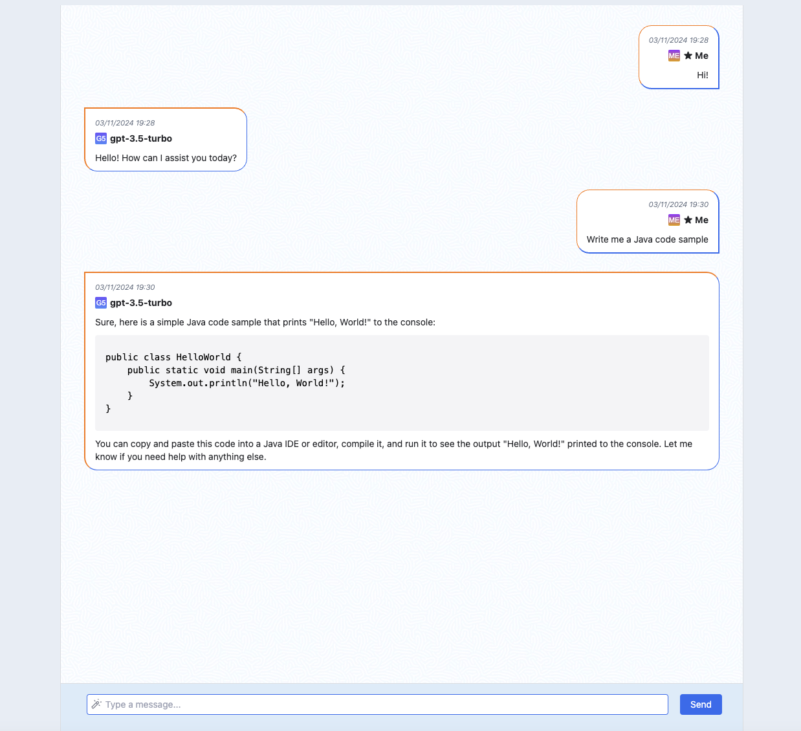

# AI Friend Chat 🐈‍⬛

## Project description



This chat-like web-interface is designed with a purpose of communication with ChatGPT 3.5. 

The "AI Friend" app is a simple chat consisting of:
1. Window with all messages displayed.
2. Text input field where text can be directly typed or pasted.
3. "Send" button (or "Enter" key) to send a request to server.

The app itself is adaptive, functional and can be used for its purpose.

## Features

With this chat it is possible to:
- "chat" with ChatGPT
- receive markdown-formated answers
- enjoy app's unique design and a cute furry mascot 🐱

## How to get started

Step 1: Download repo and unzip file.

Step 2: Run `npm install`.

Step 3: Open .env file and add two keys - 


```
REACT_APP_ORGANIZATION_KEY= {ChatGPT organization id}
REACT_APP_API_KEY= {ChatGPT api key}
```

Step 4: Run `npm run start`.

Step 5: Open [localhost](http://localhost:3000/) in Chrome.

Step 6: Enjoy! 


